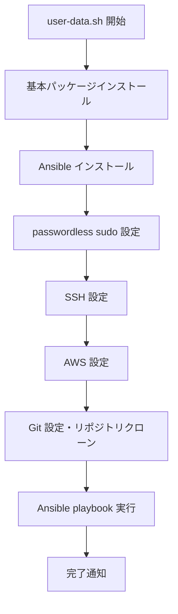

# EC2 Ubuntu User Data Script 仕様書

## 概要

EC2 Ubuntu インスタンス起動時に実行される Cloud-init user data script の仕様書です。従来の個別ツールインストール方式から、Ansible automation に移行したアーキテクチャを採用しています。

## アーキテクチャ

### 設計方針

- **統一された環境構築**: WSL Ubuntu 版と同じ Ansible playbook を使用
- **保守性の向上**: バージョン管理を一元化
- **エラー回復性**: 各ステップでのエラーハンドリングと通知
- **ログ記録**: 詳細なログ出力と Discord 通知

### 実行フロー



## 機能仕様

### 1. 基本パッケージインストール (`install_packages`)

**目的**: Ansible 実行に必要な基本パッケージのインストール

**インストールパッケージ**:
- `git` - リポジトリクローン用
- `unzip`, `curl` - ファイルダウンロード・展開用
- `python3`, `python3-pip`, `python3-venv` - Ansible 依存関係
- `software-properties-common` - PPA リポジトリ追加用

### 2. Ansible インストール (`install_ansible`)

**目的**: 最新版 Ansible の取得とインストール

**手順**:
1. Ansible PPA リポジトリの追加
2. Ansible パッケージのインストール
3. バージョン確認

### 3. passwordless sudo 設定 (`setup_passwordless_sudo`)

**目的**: Ansible playbook の非対話実行を可能にする

**設定内容**:
```bash
# /etc/sudoers.d/ubuntu
ubuntu ALL=(ALL) NOPASSWD:ALL
```

**セキュリティ考慮**:
- ファイル権限: 440
- 対象ユーザー: ubuntu のみ
- 用途: EC2 インスタンス内でのみ有効

### 4. SSH 設定 (`setup_ssh`)

**目的**: GitHub リポジトリへの SSH 接続設定

**設定内容**:
- SSH 秘密鍵の配置 (`~/.ssh/id_rsa`)
- SSH 設定ファイルの作成 (`~/.ssh/config`)
- GitHub known_hosts の追加

**セキュリティ**:
- 秘密鍵権限: 600
- SSH ディレクトリ権限: 700

### 5. AWS 設定 (`setup_aws`)

**目的**: AWS CLI 認証情報の設定

**設定ファイル**:
- `~/.aws/credentials` - アクセスキー情報
- `~/.aws/config` - リージョン・出力形式設定
- `~/.bashrc` - 環境変数設定

### 6. Git 設定 (`setup_git`)

**目的**: Git ユーザー設定とリポジトリクローン

**実行内容**:
1. Git グローバル設定 (user.name, user.email)
2. 開発ディレクトリ作成 (`/home/ubuntu/dev`)
3. Environment リポジトリのクローン

### 7. Ansible Playbook 実行 (`run_ansible`)

**目的**: WSL Ubuntu 版と同じ環境の構築

**実行コマンド**:
```bash
ansible-playbook site.yml \
  -i inventory/hosts \
  --connection=local \
  --become \
  --become-method=sudo \
  -v
```

**対象 Playbook**: `platform/wsl-ubuntu/ansible/site.yml`

## 設定値

### 定数定義

| 変数名 | 値 | 説明 |
|--------|-----|------|
| `LOG_FILE` | `/home/ubuntu/setup-output.log` | ログファイルパス |
| `USER_NAME` | `ubuntu` | 対象ユーザー名 |
| `DEV_DIR` | `/home/ubuntu/dev` | 開発ディレクトリ |
| `ANSIBLE_DIR` | `/home/ubuntu/dev/private-kit/enviroment/platform/wsl-ubuntu/ansible` | Ansible ディレクトリ |

### 認証情報

- **Discord Webhook**: セットアップ進捗通知用
- **AWS 認証情報**: AWS リソースアクセス用
- **Git 認証情報**: ユーザー設定用
- **SSH 秘密鍵**: GitHub アクセス用

## エラーハンドリング

### エラー処理機能

1. **handle_error 関数**
   - エラーメッセージのログ出力
   - Discord への通知送信
   - プロセスの終了 (exit 1)

2. **trap 設定**
   - 予期しないエラーの捕捉
   - 自動エラーハンドリング

### 通知機能

- **ログ出力**: タイムスタンプ付きでファイルとコンソールに出力
- **Discord 通知**: 各ステップの進捗と結果を通知

## 利用される Ansible Roles

以下の roles が `platform/wsl-ubuntu/ansible/site.yml` から実行されます:

- **base**: 基本システムパッケージ
- **ssh**: OpenSSH サーバー設定
- **development-runtime**: Node.js, Go, Java, Kotlin 等
- **docker**: Docker & Docker Compose
- **kubernetes**: kubectl, kind, helm, kustomize
- **aws**: AWS CLI とクラウドツール
- **postgresql**: PostgreSQL 15 with extensions
- **cache**: Redis (オプション)
- **monitoring**: 監視ツール (オプション)

## セキュリティ考慮事項

### 認証情報管理

- **SSH 秘密鍵**: スクリプト内にハードコーディング (要改善)
- **AWS 認証情報**: 環境変数とファイルに設定
- **passwordless sudo**: EC2 内でのみ有効

### 改善提案

1. **秘密情報の外部化**: AWS Secrets Manager や Parameter Store の利用
2. **IAM Role 使用**: インスタンスプロファイルでの認証
3. **SSH 鍵の動的生成**: 起動時の鍵ペア生成

## ログとモニタリング

### ログファイル

- **場所**: `/home/ubuntu/setup-output.log`
- **フォーマット**: `[YYYY-MM-DD HH:MM:SS] メッセージ`
- **内容**: 各ステップの実行結果と詳細情報

### 通知

- **Discord Webhook**: リアルタイム進捗通知
- **メッセージ形式**: 絵文字付きステータス更新

## 今後の改善方向

### Docker 化への移行

現在の Ansible 依存から Docker コンテナ化への段階的移行:

1. **短期**: 現在の Ansible 方式の安定化
2. **中期**: Docker + 最小限 Ansible のハイブリッド
3. **長期**: 完全 Docker 化 (`docker run kurosawa-kuro/dev-Environment`)

### 利点

- **Ansible インストール不要**
- **軽量で高速な起動**
- **環境の一貫性保証**
- **バージョン管理の簡素化**

## 使用方法

### Terraform での利用

```hcl
resource "aws_instance" "ubuntu" {
  # ... other configuration ...
  
  user_data = file("${path.module}/user-data.sh")
  
  tags = {
    Name = "Ubuntu-Dev-Environment"
  }
}
```

### 手動実行

```bash
# EC2 インスタンス上で
sudo bash /path/to/user-data.sh
```

## トラブルシューティング

### 一般的な問題

1. **Ansible 実行失敗**: passwordless sudo 設定を確認
2. **Git クローン失敗**: SSH 鍵と GitHub 接続を確認
3. **AWS 認証失敗**: 認証情報の正確性を確認
4. **パッケージインストール失敗**: インターネット接続を確認

### ログ確認

```bash
# セットアップログの確認
tail -f /home/ubuntu/setup-output.log

# Ansible ログの確認
cat /home/wsl/.ansible/ansible.log
```
