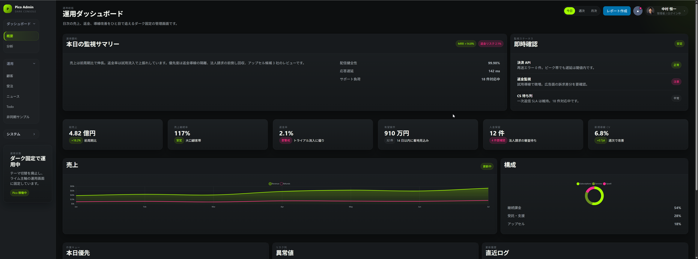

# pico-admin-template

`Pico CSS` ベースのダークテーマ固定・デスクトップファースト管理画面テンプレートです。




## 構成

```txt
src/
  index.html
  pages/
    admin/
      analytics.html
      customers.html
      news.html
      ajax.html
      orders.html
      todo.html
      settings.html
    auth/
      signin.html
      signup.html
      reset-password.html
    errors/
      404.html
  css/
  js/
  images/
  tests/e2e/
  scripts/serve-static.mjs
  package.json
  playwright.config.js
doc/
  README.md
  01_仕様と設計.md
  02_移行ロードマップ.md
  03_実装カタログ.md
  04_運用.md
Makefile
README.md
```

## 画面

- [src/index.html](./src/index.html)
- [src/pages/admin/analytics.html](./src/pages/admin/analytics.html)
- [src/pages/admin/customers.html](./src/pages/admin/customers.html)
- [src/pages/admin/news.html](./src/pages/admin/news.html)
- [src/pages/admin/ajax.html](./src/pages/admin/ajax.html)
- [src/pages/admin/orders.html](./src/pages/admin/orders.html)
- [src/pages/admin/todo.html](./src/pages/admin/todo.html)
- [src/pages/admin/settings.html](./src/pages/admin/settings.html)
- [src/pages/auth/signin.html](./src/pages/auth/signin.html)
- [src/pages/auth/signup.html](./src/pages/auth/signup.html)
- [src/pages/auth/reset-password.html](./src/pages/auth/reset-password.html)
- [src/pages/errors/404.html](./src/pages/errors/404.html)

## 特徴

- ダークテーマ固定
- デスクトップ PC 操作を第一目的としたレイアウト
- レスポンシブは維持するが、設計順は desktop-first
- 業務画面向けに余白、カード高さ、ツールバー密度を圧縮
- 白いカード面、白いテーブル面を避ける
- 通常情報は無彩色、必要時だけライム / ピンクを使う
- `news / orders / todo / ajax` まで同一トーンで運用ページを展開

## favicon

`src/images/favicons/` に用途別サンプルを配置している。

- `admin-dashboard.svg`
- `news.svg`
- `ai-tools.svg`
- `todo.svg`
- `scheduler.svg`
- `sample-app.svg`

既定は `admin-dashboard.svg`。

## E2E

環境構築と起動:

```bash
make install
make playwright-install
make serve
```

- ブラウザ確認先は `http://127.0.0.1:4173/index.html`
- 停止は `Ctrl+C`

E2E 実行:

```bash
make e2e
```

- 静的配信は `make serve`
- 既定 URL は `http://127.0.0.1:4173/index.html`
- `Playwright` project は `chromium-desktop`, `webkit-desktop`, `tablet-regression`

## ドキュメント

- [doc/README.md](./doc/README.md)
- [doc/01_仕様と設計.md](./doc/01_仕様と設計.md)
- [doc/02_移行ロードマップ.md](./doc/02_移行ロードマップ.md)
- [doc/03_実装カタログ.md](./doc/03_実装カタログ.md)
- [doc/04_運用.md](./doc/04_運用.md)
